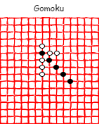

#Gomoku

This repository contains an implementation of Gomoku game. The main goals for creating this application were:

- Developing an application by exercising **Test Driven Development** (TDD)
- Implementing a clean architecture where modules are decoupled in such a way that 
as the application grows the base can adapt easily
- Having some fun while learning!

To really understand the main concepts underlying the logic and architecture of this repository
the reader is advised to study the articles below:

- [Gomoku Part 1: Understanding the Game, Setup and Base](https://pmesgari.github.io/techhighlands/article/gomoku-1)
- [Gomoku Part 2: Understanding the Geometry and Win Algorithm](https://pmesgari.github.io/techhighlands/article/gomoku-2)
- [Gomoku Part 3: Understanding the Architecture and Decisions Made](https://pmesgari.github.io/techhighlands/article/gomoku-3)

##References

Implementing this application was my own personal experience in applying the concepts and 
ways of working I have studied through the following materials.

- [Clean Architecture](https://www.amazon.com/Clean-Architecture-Craftsmans-Software-Structure/dp/0134494164#ace-g9859629705)
- [Clean Agile](https://www.amazon.com/Clean-Agile-Basics-Robert-Martin/dp/0135781868/ref=sr_1_11?dchild=1&qid=1609541426&refinements=p_27%3ARobert+Martin&s=books&sr=1-11&text=Robert+Martin)
